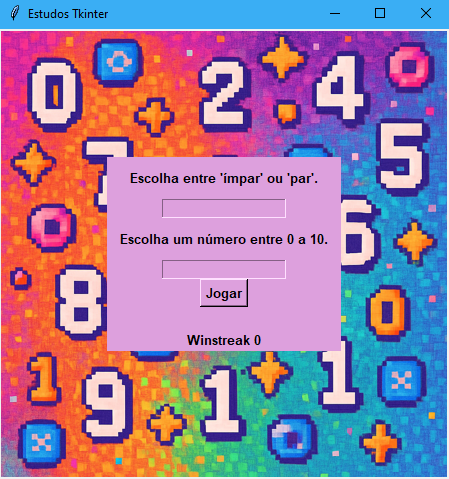

# 🎮 Jogo do "Par" ou "Ímpar"

Este é um jogo simples de "Par ou Ímpar" feito em Python para praticar o uso da biblioteca Tkinter.  
O jogador escolhe entre *Par* ou *Ímpar*, depois escolhe um número de 0 a 10.  
O computador também escolhe um número aleatório, e o programa soma os dois valores e determina o vencedor.

---

## ▶️ Como executar

1. Baixe os arquivos da pasta **Programa**.
2. Execute o código `jogo.py` em um ambiente que rode Python (como VS Code, Thonny, IDLE, etc).
3. Certifique-se de que o arquivo **Fundo.png** esteja na mesma pasta do código para que o fundo apareça corretamente.

---

## 💡 O que você vai ver neste projeto

- Uso de condicionais (`if/elif/else`).
- Lógica de comparação e validação de entrada.
- Geração de valores aleatórios com `random`.
- Interface gráfica com Tkinter.
- Uso das bibliotecas:
  - `PIL` (para exibir imagem de fundo),
  - `emoji` (para emojis no resultado),
  - `random` (para a jogada da máquina).=

---

## 📷 Imagem

---

